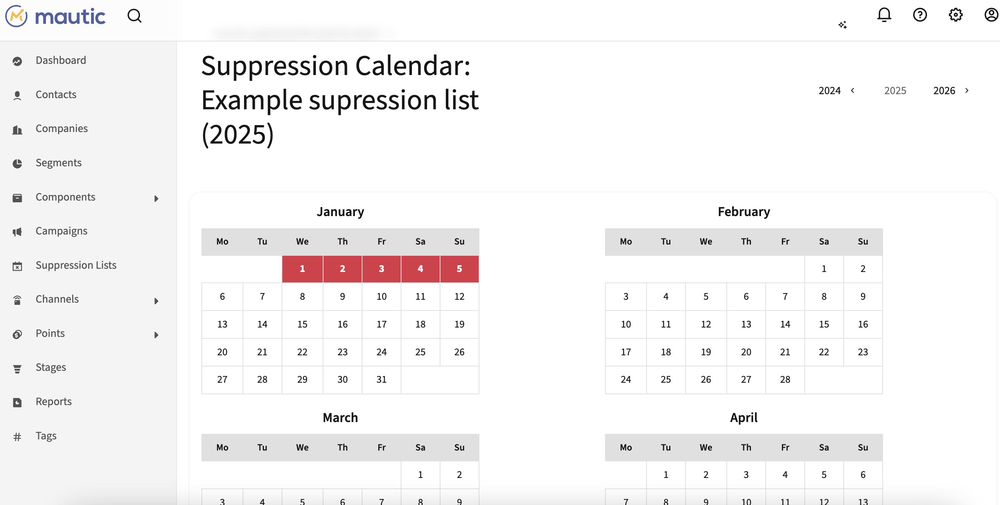

# Mautic Email Suppression Bundle

A comprehensive plugin for managing email suppression dates in Mautic. Define blackout periods when emails should not be sent to specific segments and campaigns, with an intuitive calendar interface for date selection.

## Overview

The Mautic Email Suppression Bundle allows marketers to create suppression lists with specific dates when emails should be blocked. Link these lists to segments and campaigns to prevent email sends during holidays, company events, maintenance windows, or any other blackout periods.


## Features

- **Suppression List Management** - Create and manage multiple suppression lists with custom names
- **Interactive Calendar Interface** - Visual calendar for selecting suppression dates with click-to-toggle functionality
- **Date Range Support** - Consecutive dates are automatically displayed as ranges (e.g., "25 - December - 2025 — 31 - December - 2025")
- **Segment Integration** - Link suppression lists to specific segments
- **Campaign Integration** - Link suppression lists to specific campaigns
- **Detailed Views** - See all information about suppression lists including linked segments, campaigns, and dates
- **Year Navigation** - Easily browse through different years to manage future suppression dates
- **Real-time Updates** - AJAX-powered date toggling for instant feedback



## Use Cases

- **Holiday Blackouts** - Block email sends during Christmas, New Year, or other holidays
- **Maintenance Windows** - Prevent emails during scheduled system maintenance
- **Company Events** - Suppress emails during conferences, trade shows, or company-wide events
- **Regional Holidays** - Manage different holiday schedules for different segments/regions
- **Compliance Periods** - Block sends during regulatory quiet periods
- **Customer-specific Requests** - Honor individual customer preferences for email-free periods

## Requirements

- Mautic 4.0+ or Mautic 5.0+
- PHP 7.4 or 8.0+
- MySQL/MariaDB database

## Installation

### Via Composer

```bash
composer require woutersf/email-suppression-bundle
```

### Manual Installation

1. Download or clone this repository
2. Place the `MauticEmailSupressionBundle` folder in `docroot/plugins/`
3. Clear Mautic cache:
   ```bash
   php bin/console cache:clear
   ```
4. Run database migrations:
   ```bash
   php bin/console doctrine:migrations:migrate
   ```
5. Go to Mautic Settings → Plugins
6. Click "Install/Upgrade Plugins"
7. Find "Email Suppression Lists" and publish it

## Database Schema

The plugin creates three tables:

### `supr_list`
- Stores suppression list definitions
- Fields: id, name, date_added, created_by

### `supr_list_date`
- Stores individual suppression dates
- Fields: id, supr_list_id, date
- Indexed for efficient date lookups

### `supr_list_campaign_segment`
- Links suppression lists to segments and campaigns
- Fields: id, supr_list_id, segment_id, campaign_id
- Either segment_id or campaign_id is set (not both)

## Usage

### Creating a Suppression List

1. Navigate to **Suppression Lists** in the main menu
2. Click **New** to create a suppression list
3. Enter a descriptive name (e.g., "Christmas Holiday 2025")
4. Select which **segments** should be affected (optional)
5. Select which **campaigns** should be affected (optional)
6. Click **Save & Close**

### Managing Suppression Dates


1. From the suppression list detail view, click **Manage Calendar**
2. Navigate to the desired year using the year navigation buttons
3. Click on any date to mark it as suppressed (turns red)
4. Click again to remove the suppression (turns white)
5. Consecutive dates are automatically displayed as ranges in the detail view

**Calendar Features:**
- Red dates = Suppressed (emails blocked)
- White dates = Normal (emails allowed)
- Bold dates = Today
- Hover over dates for visual feedback
- Year navigation with prev/next buttons

### Viewing Suppression List Details

The detail view shows:

1. **Name** - The suppression list name
2. **Selected Dates** - All suppressed dates, with consecutive dates shown as ranges
3. **Linked Segments** - All segments affected by this suppression list
4. **Linked Campaigns** - All campaigns affected by this suppression list
5. **Creation Info** - Date created and user who created it

### Editing a Suppression List

1. Navigate to the suppression list detail view
2. Click **Edit** in the actions menu
3. Update the name, segments, or campaigns
4. Click **Save & Close**

**Note:** To modify dates, use the **Manage Calendar** button from the detail view.

### Integration with Email Sends

When a suppression list is linked to:

- **Segments**: Emails to contacts in those segments are blocked on suppressed dates
- **Campaigns**: Campaign emails are blocked on suppressed dates

**How it works:**
- The suppression check happens before email sends
- If the current date matches a suppressed date for the recipient's segment or campaign, the email is not sent
- Emails are not queued or delayed - they are simply skipped
- This ensures compliance with blackout periods

## Configuration

No additional configuration is required. The plugin works out of the box after installation.

### Permissions

The plugin uses standard Mautic permissions:

- `supressionlist:supressionlists:view` - View suppression lists
- `supressionlist:supressionlists:create` - Create new suppression lists
- `supressionlist:supressionlists:edit` - Edit existing suppression lists
- `supressionlist:supressionlists:delete` - Delete suppression lists

Configure these in **Settings → Roles**.

## Best Practices

1. **Descriptive Names** - Use clear names that indicate the purpose and year (e.g., "Q4 2025 Holiday Blackout")
2. **Plan Ahead** - Set up suppression dates well in advance of the blackout period
3. **Review Regularly** - Check suppression lists annually and update for new years
4. **Segment-Specific** - Create different suppression lists for different regions or customer types
5. **Document Reasons** - Include the reason in the list name for future reference
6. **Test First** - Verify suppression behavior with a test segment before applying to production
7. **Coordinate Teams** - Ensure marketing, sales, and support teams are aware of blackout periods

## Troubleshooting

### Calendar dates not turning red when clicked

**Solution:**
1. Check browser console for JavaScript errors
2. Ensure AJAX requests are completing successfully
3. Clear browser cache
4. Verify the date is being saved in the database

### Suppression not working for emails

**Solution:**
1. Verify the suppression list is linked to the correct segment or campaign
2. Check that the current date matches a suppressed date in the calendar
3. Ensure the plugin is published and enabled
4. Review email send logs for suppression indicators

### Changes not saving

**Solution:**
1. Clear Mautic cache
2. Check database permissions
3. Verify form validation is passing
4. Check Mautic logs for errors

### Calendar showing wrong dates

**Solution:**
1. Verify server timezone is configured correctly
2. Check PHP date/time settings
3. Ensure database timezone matches application timezone

## API Integration

### Get Suppression Dates for a List

```php
$model = $this->getModel('supressionlist.supressionlist');
$dates = $model->getDatesBySuprListId($suprListId);
```

### Check if Date is Suppressed

```php
$model = $this->getModel('supressionlist.supressionlist');
$dateObj = new \DateTime('2025-12-25');
$dateEntity = $model->findDateBySuprListAndDate($suprListId, $dateObj);
$isSuppressed = ($dateEntity !== null);
```

### Get Linked Segments and Campaigns

```php
$model = $this->getModel('supressionlist.supressionlist');
$linkedData = $model->getLinkedSegmentsAndCampaigns($suprListId);
$segments = $linkedData['segments'];
$campaigns = $linkedData['campaigns'];
```

## Development

### Adding Custom Suppression Logic

Extend the suppression checking by listening to email send events:

```php
use Symfony\Component\EventDispatcher\EventSubscriberInterface;

class EmailSuppressionSubscriber implements EventSubscriberInterface
{
    public static function getSubscribedEvents(): array
    {
        return [
            EmailEvents::EMAIL_ON_SEND => ['onEmailSend', 0],
        ];
    }

    public function onEmailSend(EmailSendEvent $event)
    {
        // Custom suppression logic here
    }
}
```

### Database Queries

The plugin uses optimized database queries with proper indexes:

- Index on `supr_list_date.supr_list_id` for fast date lookups
- Index on `supr_list_date.date` for date range queries
- Composite index on `(supr_list_id, date)` for toggle operations

## Architecture

```
┌─────────────────────────────────────┐
│  Mautic Email Suppression Bundle    │
│                                     │
│  ┌─────────────────────────────┐   │
│  │  Controllers                │   │
│  │  - List management          │   │
│  │  - Calendar view            │   │
│  │  - Date toggle (AJAX)       │   │
│  └─────────────────────────────┘   │
│                                     │
│  ┌─────────────────────────────┐   │
│  │  Model Layer                │   │
│  │  - CRUD operations          │   │
│  │  - Date management          │   │
│  │  - Segment/campaign linking │   │
│  └─────────────────────────────┘   │
│                                     │
│  ┌─────────────────────────────┐   │
│  │  Entity Layer               │   │
│  │  - SuprList                 │   │
│  │  - SuprListDate             │   │
│  │  - SuprListCampaignSegment  │   │
│  └─────────────────────────────┘   │
└─────────────────────────────────────┘
              ↓ integrates with
┌─────────────────────────────────────┐
│         Mautic Core                 │
│  - Email sending engine             │
│  - Segment management               │
│  - Campaign execution               │
└─────────────────────────────────────┘
```

## Roadmap

Future enhancements being considered:

- [ ] Recurring date patterns (e.g., "every Friday")
- [ ] Import/export suppression dates
- [ ] Bulk date operations
- [ ] Suppression templates for common holidays
- [ ] Email notification before suppression periods
- [ ] Integration with external calendar systems
- [ ] Suppression analytics and reporting
- [ ] Time-based suppression (not just dates)

## Support

- GitHub Issues: [Report an issue](https://github.com/yourusername/mauticorangepoc/issues)
- Mautic Community: [community.mautic.org](https://community.mautic.org)

## License

GPL-3.0-or-later

## Credits

Created by Frederik Wouters and the Mautic Community

## Version

1.0.0

## Changelog

### 1.0.0 (2024)
- Initial release
- Suppression list management
- Interactive calendar interface with year navigation
- Date range formatting for consecutive dates
- Segment and campaign linking
- AJAX-powered date toggling
- Detailed view with all suppression information
- Real-time calendar updates
- Comprehensive permission system
